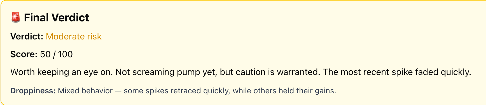
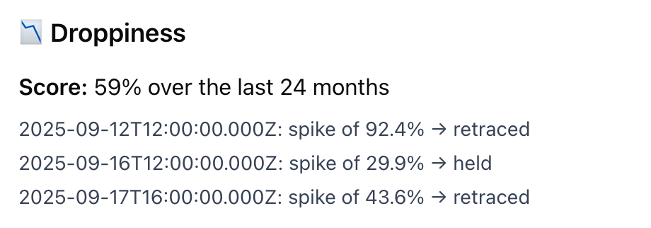
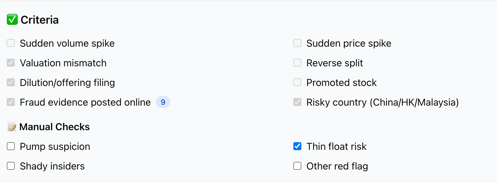

# 📘 Pump Scorecard

The **Pump Scorecard** is a Next.js app that scans a stock ticker and produces a **risk scorecard** to help identify potential pump-and-dump activity.  
It combines **market data, SEC filings, promotions, fraud evidence, and intraday behavior** into a weighted risk score and summary verdict.

---

## 🚀 Usage

### 🔍 Scanning a Ticker
1. Enter a ticker symbol (e.g., `AAPL`, `QMMM`) into the input box.  
2. Click **Scan**.  
3. The app will fetch and analyze:
   - Fundamentals  
   - Historical charts  
   - SEC filings  
   - Promotion evidence  
   - Fraud images  
   - Droppiness (spike/retrace patterns)

📸 Example: Final Verdict Card  


📸 Example: SEC Filings + Fraud Evidence  


📸 Example: Droppiness Scatter  


📸 Example: Criteria Section  


### 📄 Exporting a Scorecard
- Click **Export PDF** to generate a PDF report for the current ticker.  
- The PDF includes: Final Verdict, Charts, Criteria, Fundamentals, Filings, Promotions, Fraud Evidence, and Droppiness.

---

## 📊 Sections & Interpretation

### ✅ Final Verdict
- **Verdict** (Low / Moderate / High Risk)  
- **Score (0–100)** adjusted for auto + manual signals  
- **Summary** explains what drove the risk rating  
- **Droppiness Verdict**: how spikes have behaved historically

### 📊 Charts
- **6-month daily chart** (Yahoo Finance)  
- **Droppiness Scatter**: shows spikes and whether they retraced vs held

### 🌍 Country
- Uses data from SEC, Polygon, or Yahoo  
- Flags risky jurisdictions: **China / Hong Kong / Malaysia**

### 📝 Criteria
- **Auto signals**:
  - Sudden volume spike  
  - Sudden price spike  
  - Valuation mismatch  
  - Reverse split  
  - Dilution/offering filing (S-1, 424B, etc.)  
  - Promoted stock evidence  
  - Fraud evidence online  
  - Risky country  

- **Manual flags** (user-checked):
  - Pump suspicion  
  - Thin float  
  - Shady insiders  
  - Other red flag  

> ✅ Manual checks update the risk score dynamically

### 💵 Fundamentals
- Last Price, Market Cap, Shares Outstanding, Float  
- Average & Latest Volume  
- Short Float %, Insider %, Institutional %  
- Values normalized and formatted (e.g. `14.8B`, `56.2M`)

---

## 🛠️ How Risk Scoring Works

### 📉 Droppiness: Spike & Fade Analysis

- **Data period**: last ~24 months of intraday 1-min data (from Polygon), aggregated to 4-hour candles  
- **Spike detection**:
  - >20% increase over previous close  
  - Accompanied by volume much higher than normal (e.g. 3× average)
- **Retracement check**:
  - Look ahead after each spike  
  - If price falls by >50% from the spike high → considered “faded (retraced)”  
  - Otherwise considered “held”
- **Score calculation**:
  - Count of faded spikes divided by total spikes, scaled to 0-100  
  - If many spikes fade → higher droppiness score  
  - If few shadows or most spikes hold → lower droppiness score
- **Verdicts**:
  - **No qualifying spikes** → *“No qualifying spikes in the last 24 months”*  
  - **Droppiness ≥ 70** → *“Spikes usually fade quickly”*  
  - **Droppiness < 40** → *“Spikes often hold”*  
  - **Otherwise** → *“Mixed behavior”*

---

## ⚙️ Technical Details & Scoring by Component

| Component | How the data is retrieved | What’s checked | How it adds to the risk score |
|-----------|----------------------------|----------------|-------------------------------|
| **Yahoo Finance** | `quote` + `quoteSummary` modules + `chart` API | Float & short interest; insider/institutional ownership; price history; volume | Short float & low insider ownership increase risk; price & volume spikes feed into droppiness & other criteria |
| **Polygon.io** | Reference metadata + intraday raw data (1-min), aggregated to 4-hr candles | Country metadata; intraday behavior for droppiness | Country risk; droppiness behavior derived from intraday bars |
| **SEC Filings (EDGAR)** | company tickers JSON → CIK → submission filings | Dilution / stock offerings; reverse splits; filing frequency | Offers (S-1, 424B etc.) + reverse split add significant risk points |
| **Promotions tracker** | StockPromotionTracker API by ticker | If promotions are found, types & dates | Presence of promotions adds risk; more sources or frequent promotions add more points |
| **Fraud Evidence** | stopnasdaqchinafraud.com API | Ticker-token matches in caption/text; image evidence if available | Visual / fraud evidence adds major risk; lack of evidence lowers risk |
| **Country Risk** | SEC business address; fallback to Polygon or Yahoo | HQ country; flags risky ones like China, Hong Kong, Malaysia | Risky country adds moderate risk |
| **Manual Flags (User)** | Checkboxes in UI | Pump suspicion; thin float; insiders; etc. | Each adds bonus points; affects final verdict dynamically |

---

## 🔢 Risk Scoring Formula

1. **Auto-detected signals** (weighted equally among):  
   - Sudden volume spike  
   - Sudden price spike  
   - Dilution (offerings, reverse splits)  
   - Fraud evidence  
   Each gives a base chunk of the score when present.

2. **Droppiness Adjustment**:  
   - If spikes mostly fade → subtract or boost depending on behavior (e.g. if many fade, that signals risk)  

3. **Manual Flags**:  
   - User can add flags; each adds bonus risk points

4. **Capping and mapping**:  
   - Final score capped between 0-100  
   - Score mapped to verdict:  
     - < 40 → **Low risk**  
     - 40–69 → **Moderate risk**  
     - ≥ 70 → **High risk**

---

## 🧰 Tech Stack

- Next.js 15.5.3 (App Router + API routes)  
- React (client / server components)  
- TailwindCSS styling  
- Yahoo Finance (`yahoo-finance2`), Polygon.io, SEC Edgar, StockPromotionTracker, stopnasdaqchinafraud APIs  
- PDF export functionality  

---

## 🔮 Potential Enhancements

- Watchlist / batch scanning mode  
- Risk trends chart  
- Borrow fee / short interest charge data  
- Social sentiment (Telegram, Twitter) integration  

---

## 📦 Setup & Dev Commands

```bash
npm install
npm run dev
npm run build
npx prettier --write .
