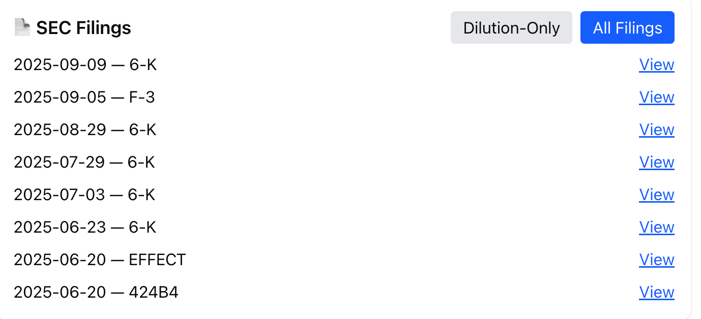

# 📘 Pump Scorecard

The **Pump Scorecard** is a Next.js app that scans a stock ticker and produces a **risk scorecard** to help identify potential pump-and-dump activity.  
It combines **market data, SEC filings, promotions, fraud evidence, and intraday behavior** into a weighted risk score and summary verdict.

---

## 🚀 Usage

### 🔍 Scanning a Ticker
1. Enter a ticker symbol (e.g., `AAPL`, `QMMM`) into the input box.  
2. Click **Scan**.  
3. The app will fetch and analyze:
   - Fundamentals
   - Historical charts
   - SEC filings
   - Promotion evidence
   - Fraud images
   - Droppiness (spike/retrace patterns)

📸 Example: Final Verdict Card  


📸 Example: SEC Filings + Fraud Evidence  


📸 Example: Droppiness Scatter  


### 📄 Exporting a Scorecard
- Click **Export PDF** to generate a PDF report for the current ticker.  
- The PDF includes: Final Verdict, Charts, Criteria, Fundamentals, Filings, Promotions, Fraud Evidence, and Droppiness.

---

## 📊 Sections & Interpretation

### ✅ Final Verdict
- **Verdict** (Low / Moderate / High Risk).  
- **Score (0–100)** adjusted for auto + manual signals.  
- **Summary** explains what drove the risk rating.  
- **Droppiness Verdict**: how spikes typically behave.

### 📊 Charts
- **6-month daily chart** (Yahoo Finance).  
- **Droppiness Scatter**: shows spikes & retraces.

### 🌍 Country
- Uses SEC, Polygon, or Yahoo metadata.  
- Flags risky locales: **China / Hong Kong / Malaysia**.

### 📝 Criteria
- **Auto signals** (from backend).  
- **Manual flags** (user-checked, affect score).  

📸 Example: Criteria Section  


---

## ⚙️ Technical Details

### Data Sources
- **Yahoo Finance (`yahoo-finance2`)** — fundamentals, history, float, ownership.  
- **Polygon.io** — reference metadata, intraday candles.  
- **SEC Edgar** — filings and addresses.  
- **StockPromotionTracker** — promotion history.  
- **StopNasdaqChinaFraud** — fraud-related images.  

### Risk Scoring
- Auto criteria: +20 each  
- Droppiness adjustment: ±15  
- Manual flags: +10 each  
- Score capped at 0–100  

---

## 🛠️ Development

Install dependencies:
```bash
npm install
